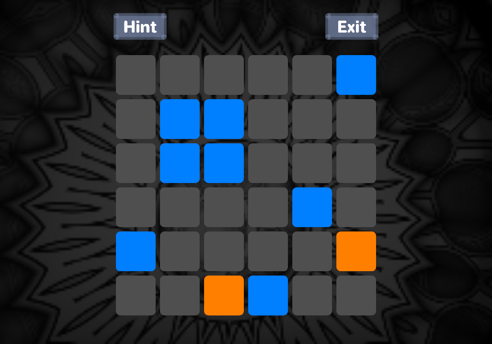
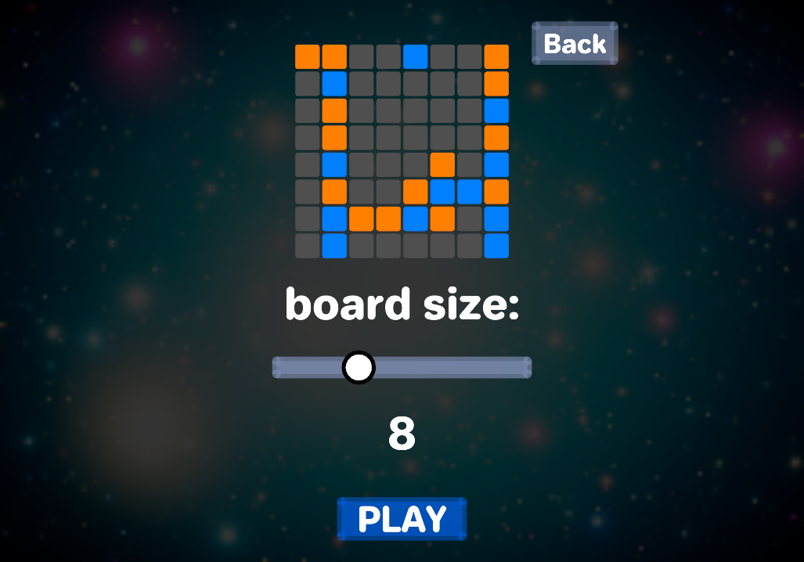
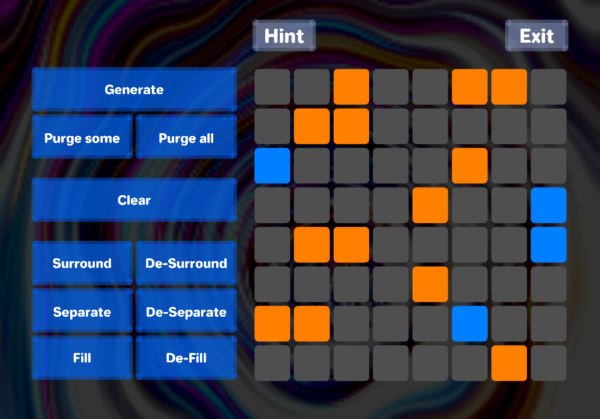
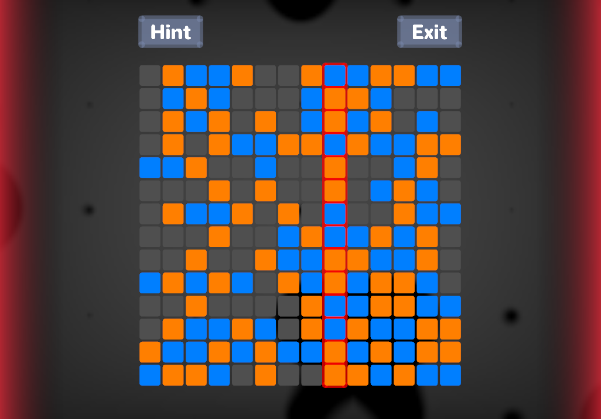
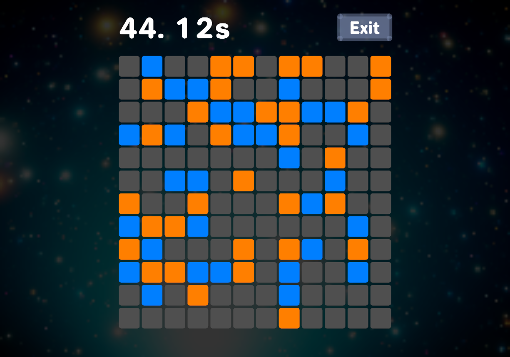

# Takuzu
## A Rust implementation of Takuzu - a binary version of sudoku

Takuzu is played on a square board with NxN cells. Cells can be either true, false, or not yet assigned 

The puzzle starts with some cells filled. The player's aim is to fill the rest of the board without breaking any rules.

## Variable board sizes

## Sandbox

Here you can play around with algorithms the program uses.

## Learn

In learn mode you can solve the puzzle and have access to hints.

## Serious mode

In this mode every second counts. Your highscores are saved.

## Multithreaded board generation

The game doesn't freeze when generating a large board.

## Chill experience
The game smoothly changes animated backgrounds and has some nice chill soundtrack. Great relax material.

# Rules
* At most two same consecutive cells (no linear triplets) 
* Equal number of trues and falses in a row/column 
* No two equal rows
* No two equal columns